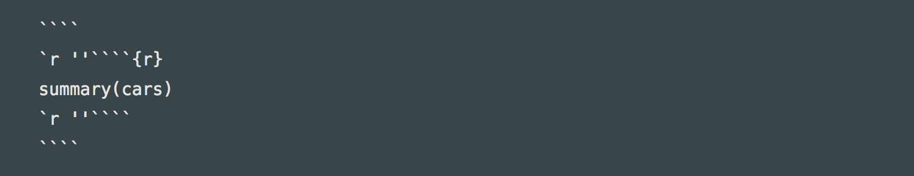

[R Markdown Cheat Sheet](https://github.com/rstudio/cheatsheets/raw/master/rmarkdown-2.0.pdf)

## コードチャンクのオプション

よく使うもの、まとめて変更する方法、具体例

[Options - Chunk options and package options - Yihui Xie | 谢益辉](https://yihui.name/knitr/options/)

### まとめて変更する方法

セットアップチャンク的に記載しておくとそのRmdファイル全体に適応される。

```{r eval=FALSE}
knitr::opts_chunk$set(
  echo = FALSE,
  prompt = TRUE
  )
```

### ソースコードだけを表示

eval=FALSE

### ソースコードの出力を調節

echo、特定の行のみとか

### Warningを表示しない


### html出力をそのまま渡す

asis

## YAMLフロントマター

### 日本語見出しのおまじない

日本語（特に半角数字との組み合わせで）見出しでリンクがおかしくなるのを解決する方法。

```YAML
---
output:
  html_document:
    pandoc_args:
    - --from
    - markdown+autolink_bare_uris+tex_math_single_backslash-implicit_figures
---
```

こっちでも良い？

```YAML
---
output:
  html_document:
    md_extensions: -ascii_identifiers
---
```


### 日付を更新日に

yamlに以下を記載する

```YAML
---
  date: "`r format(Sys.time(), '%Y-%m-%d')`"
---
```


- [第4回　レポつく自由自在 ～R Markdownにまつわるエトセトラ～：R Markdownで楽々レポートづくり｜gihyo.jp … 技術評論社](http://gihyo.jp/admin/serial/01/r-markdown/0004?page=2)
- [R Markdown スライドとPDF 文章（日本語含む）作成メモ - Knowledge As Practice](https://hikaru1122.hatenadiary.jp/entry/rmarkdown)
- [uribo/lab.note: Create Laboratory Note and Report Using R Markdown](https://github.com/uribo/lab.note)
- [第4回　レポつく自由自在 ～R Markdownにまつわるエトセトラ～：R Markdownで楽々レポートづくり｜gihyo.jp … 技術評論社](http://gihyo.jp/admin/serial/01/r-markdown/0004?page=3)


## 画像の表示方法

- [knitr figure - A plant researcher](https://keachmurakami.github.io/page/2016/08/05/knitr-figure/)

### Markdown記法で表示

```markdown
# web上のファイルへのリンク


# 画像にリンクを貼っておく
[](https://www.r-project.org/)
```


[](https://www.r-project.org/)

### chunk内で`knitr::include_graphics`を利用

````
`r ''````{r fig1, fig.cap = 'キャプション', echo = FALSE, out.width = "100px"}
knitr::include_graphics(path = "img/Rlogo.png")
`r ''````
````

```{r fig1, fig.cap = 'キャプション', echo = FALSE, out.width = "100px"}
knitr::include_graphics(path = "img/Rlogo.png")
```

チャンクラベル（この場合「fig1」）を用いた相互参照や大きさの調節ができる。

## Rmd中にRチャンクをコードブロックとして表示

[R MarkdownでRチャンクをコードブロックとして表示したい - Qiita](https://qiita.com/kazutan/items/fb655efd363a3d9aa865)

神がいらっしゃった。ちゃんと処理を理解していることが大事ということか……。[公式のFAQ](https://yihui.name/knitr/faq/)でも解決できなかったのに。でもこのコードをこれからknitされるここに記載する方法がわからない……。`` `r
''` ``をコードチャンクの2箇所の```` ``` ````の前に挿入した上で、全体を1つ多い4つのbacktickで囲む。ここだけでも十分[トリッキー](https://yihui.name/en/2017/11/knitr-verbatim-code-chunk/)だし……。表示は諦めて画像です。

```{r, echo = FALSE, fig.cap = 'RチャンクのR Markdownでのエスケープ方法'}

```

[markdown - How to display verbatim inline r code with backticks using Rmarkdown? - Stack Overflow](https://stackoverflow.com/questions/20409172/how-to-display-verbatim-inline-r-code-with-backticks-using-rmarkdown)

もどうしても必要になったら考慮しよう。

## その他

### GitHubのコードを表示する

ページの内容を取得して処理してハイライトして……、とはやらずに外部サービスの力を借りる。なおGistの方なら埋め込み用のURLをそのまま取得できるので貼るだけ。通常のレポジトリのコードを埋め込みたい時用。

[gist-it.appspot.com - Embed files from a github repository like a gist](https://gist-it.appspot.com/)

```markdown
<script src="https://gist-it.appspot.com/「対象のGitHubURL」"></script>
```

と本文中（Markdown書式中のHTMLコードとして）に書くだけで良い。「対象のGitHubURL」は`https://github.com/u-4/dotfiles/blob/master/.Rprofile`みたいな形式で普通にGitHubでコードを見にいく時のURLママ。最後に`?slice=0:3`などとすれば表示する行を選択できる。RStudioのsnippetにも登録した。Markdownの項目に入れておき、展開は「`Shift+Tab`」（初めて知った）。

<script src="https://gist-it.appspot.com/https://github.com/u-4/dotfiles/blob/master/.Rprofile?slice=0:3"></script>

## 論文作る？

- [アカデミアのためのRSTUDIO](https://ytake2.github.io/create.manuscript/RStudio_for_Academia.html)
- [rstudio/rticles: LaTeX Journal Article Templates for R Markdown](https://github.com/rstudio/rticles)
- [crsh/papaja: papaja (Preparing APA Journal Articles) is an R package that provides document formats and helper functions to produce complete APA manscripts from RMarkdown-files (PDF and Word documents).](https://github.com/crsh/papaja)
- [papaja: Reproducible APA manuscripts with R Markdown](https://crsh.github.io/papaja_man/)


