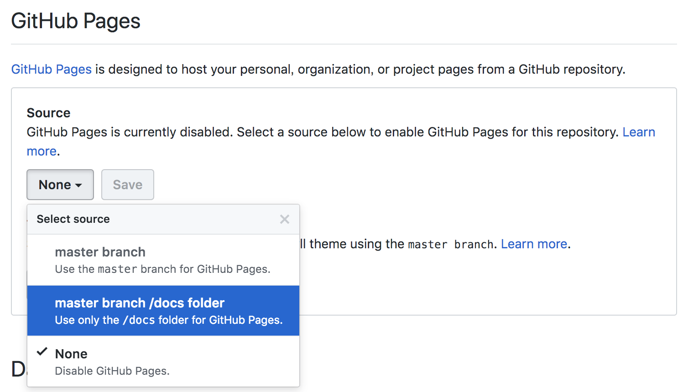

## R MarkdownでWebページを作成

R MarkdownからRStudioおよび`rmarkdown`パッケージの機能を用いて[GitHub Pages](https://pages.github.com/)にサイトを構築する。RStudioの標準機能でビルドも容易に行うことができる。

[10.5 rmarkdown’s site generator | R Markdown: The Definitive Guide](https://bookdown.org/yihui/rmarkdown/rmarkdown-site.html)

### blogdownパッケージの検討

最近は`blogdown`パッケージを用いてGo言語でできた[Hugo](https://gohugo.io/)というフレームワークを使って構築するのが流行りのようだが、操作が煩雑なこと、TOCをfloatにできなかったりするので単純な方法で着手する。いずれにせよコンテンツとしてはR Markdownないし素のMarkdownで作成しているため移行は簡単なはず。`rmarkdown`による方法では`XXX.Rmd`から`baseurl/XXX.html`が生成され、`blogdown`では`baseurl/XXX/index.html`（index.htmlは省略可）の形になるという違いがある。

## TOC test

test section for TOC float

## html_documentのオプション

`blogdown`ではなく標準の`rmarkdown`パッケージによるhtml作成の利点として、出力が`blogdown::html_page`ではなく標準の`html_document`なために普段と同様のオプション設定がそのまま通ることがある。特に`blogdown`でTOC_floatが通らないのは痛く、やはりブログ向けであってドキュメントの記載には向かない模様。

[3.1 HTML document | R Markdown: The Definitive Guide](https://bookdown.org/yihui/rmarkdown/html-document.html)

上記を参照に設定していく。サイト全体のオプションについては`_site.yml`の終わりの方に記載している。

- _site.ymlを表示するように
- 個別のページ（index.htmlなど）でTOCの有無を変更する方法

### テーマ

[Bootswatch: Free themes for Bootstrap](https://bootswatch.com/3/)から選択して`theme: readable`のように記載すれば良い。

### データフレームの表示

### 個別ページで設定を変える

index.htmlでTOCを表示しないようにしたければ、index.Rmdのymlに

```YAML
output:
  html_document:
    toc: false
```

としてやるだけで良い。

## GitHubレポジトリでの設定

`_site.yml`で出力先を`docs/`にしていれば、レポジトリの設定から選んでセーブするだけ。Descriptionのところにもアドレスを入れておくと良い。

```{r}

```

