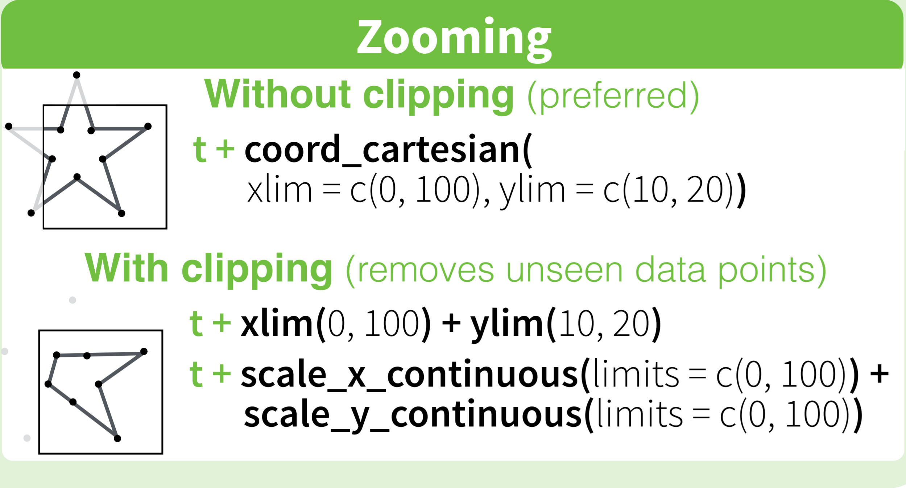

- [Data Visualization Cheat Sheet](https://github.com/rstudio/cheatsheets/raw/master/data-visualization-2.1.pdf)
- [Function reference • ggplot2](https://ggplot2.tidyverse.org/reference/)

- ggplotの基本文法
- グラフィックデバイス
- グラフの保存方法

- [Top 50 ggplot2 Visualizations - The Master List (With Full R Code)](http://r-statistics.co/Top50-Ggplot2-Visualizations-MasterList-R-Code.html)
- [論文用の棒グラフと折れ線グラフをggplot2で描く – MrUnadon – Bayesian Statistical Modelings with R and Rstan](https://mrunadon.github.io/ThesisPlot/)
- [グラフ描画ggplot2の辞書的まとめ20のコード – MrUnadon – Bayesian Statistical Modelings with R and Rstan](https://mrunadon.github.io/ggplot2/)
- [ggplot2を初歩から要点押さえて使いこなす チュートリアルとコード集](https://mrunadon.github.io/%E6%A6%82%E8%A6%81%E3%82%92%E3%81%8A%E3%81%95%E3%81%88%E3%81%A6ggplot2%E3%82%92%E4%BD%BF%E3%81%84%E3%81%93%E3%81%AA%E3%81%99%E3%83%81%E3%83%A5%E3%83%BC%E3%83%88%E3%83%AA%E3%82%A2%E3%83%AB%E3%81%A8%E3%82%B3%E3%83%BC%E3%83%89%E9%9B%86/)


## ggplot2

R言語のグラフィック作成パッケージ。dplyrと並んでtidyvereパッケージ群の中核をなす。
http://ggplot2.org/

学術論文向けにはcowplotパッケージを用いてカスタマイズすると良さそう。

ggplot2のチートシート
http://docs.ggplot2.org/current/

ggplot2の本 by Hadley Wickham
http://ggplot2.org/book/
→springerでePubとPDF購入済

[ggplot2: きれいなグラフを簡単に合理的に - Heavy Watal](https://heavywatal.github.io/rstats/ggplot2.html)

[ggplot2に関する資料まとめ - Qiita](https://qiita.com/kazutan/items/c42031ec54be283efd4f)

- [ggplot2用例集　入門編](https://www.slideshare.net/nocchi_airport/ggplot2-62471507)
- [ggplot2再入門（2015年バージョン）](https://www.slideshare.net/yutannihilation/ggplot2-53851875)

[データの可視化](https://kazutan.github.io/JSSP2018_spring/visualization.html)

[ggplot2を使って、軸を制御する-2 - Mukku John Blog](http://mukkujohn.hatenablog.com/entry/2016/10/08/155023)

ggplot2に渡すデータはtidy dataにしておく必要がある。


日本語フォントの設定

あらかじめふぉん


### 軸範囲制御

ggplot2でグラフを作成した際に、外れ値の影響で本質部分が見づらくなった時用の調整方法。

[How to set limits for axes in ggplot2 R plots? - Stack Overflow](https://stackoverflow.com/questions/3606697/how-to-set-limits-for-axes-in-ggplot2-r-plots)
にあるように2つの方法がある。ほとんどの場合は問題ないと思われるが、範囲外のデータを削るか、表示範囲を変更しているだけかという違いがある。

範囲外のデータを削る方法（非推奨）

    scale_x_continuous(limits = c(-5000, 5000))

表示範囲の制限のみを行う方法（推奨）

    coord_cartesian(xlim = c(-5000, 5000))

こちらについては簡単には以下のように書くことができる。「coord_cartesian」関数が裏にあることは認識しておくこと。

    + xlim(-5000, 5000)

```{r}

```


縦軸と横軸を入れ替えるために「`coord_flip()`」を用いている場合は「`coor_cartesian()`」と同時に用いることができないが、

    + coord_flip(ylim = c(3,5), xlim = c(100, 400))

のように書いてやればデータを失わずに軸の入れ替えと表示範囲の調節を行うことができる。


### 軸ラベル操作

軸の目盛範囲制御はggplot2での軸範囲制御へ。

[ggplot2を使って、軸を制御する-3 - Mukku John Blog](http://mukkujohn.hatenablog.com/entry/2016/10/11/220722)
[ggplot2 axis ticks : A guide to customize tick marks and labels - Easy Guides - Wiki - STHDA](http://www.sthda.com/english/wiki/ggplot2-axis-ticks-a-guide-to-customize-tick-marks-and-labels)

### グラフ要素の削除

ggplot2のx軸やラベル、目盛など多くの要素をコントロールできる。同じようなグラフをgridExtraなどを用いて並べる際に、同じx軸がダブらないようにするときなどに用いることができる。

「`opts`」とかは古いので使わない。以下を適宜コメントアウトして使用する。


    + theme(axis.line.x = element_blank(),
          axis.line.y = element_blank(),
          axis.text.x = element_blank(),
          axis.text.y = element_blank(),
          axis.ticks.x  = element_blank(),
          axis.ticks.y = element_blank(),
          axis.title.x = element_blank(),
          axis.title.y = element_blank(),
          legend.position = "none",
          panel.background = element_blank(),
          panel.border = element_blank(),
          panel.grid.major = element_blank(),
          panel.grid.minor = element_blank(),
          plot.background = element_blank()
    )

[ggplot2 axis ticks : A guide to customize tick marks and labels - Easy Guides - Wiki - STHDA](http://www.sthda.com/english/wiki/ggplot2-axis-ticks-a-guide-to-customize-tick-marks-and-labels)


### 直線やアノテーションの追加
    + geom_hline(yintercept = 5,linetype = "dashed", colour = "blue")
    + geom_vline(xintercept = 2, colour = "red")
    + geom_abline(intercept = 6, slope = -0.6)
    + annotate("text", label = "plots", x = 5, y = 2, fontface = "italic")
    + annotate("text", label = "y == -0.6 * x + 6", x = 5, y = 4, parse = TRUE)

[Farewell to Low-tech: ggplot2で作図６：直線とテキストの入れ方](http://yutakahogeta.blogspot.com/2014/09/ggplot2_22.html)


### 複数グラフ・表の整列

gridExtraでやるのはお手軽だが、幅を揃えたりの細かいことは苦手。結局`cowplot`最強な感じだったような。

- Grobオブジェクトにした上でrbind/cbindを使う
- `theme()`で余白も調節する
- Grobにしておけばlegend（凡例）も別口で取り出せる
- グラフ要素の削除で共通のx軸とかは削除できる

[r - Arrange ggplot plots (grobs with same widths) using gtable to create 2x2 layout - Stack Overflow](https://stackoverflow.com/questions/35068129/arrange-ggplot-plots-grobs-with-same-widths-using-gtable-to-create-2x2-layout)
[RPubs - ggplot2を並べる](https://rpubs.com/kohske/84415)
[ggplot2、grid、gtable、gridExtraの関係とか - Technically, technophobic.](https://notchained.hatenablog.com/entry/2015/12/17/010904)


## ggplot2 v3.0.0アップデート

[ggplot2/NEWS 3.0.0](https://github.com/tidyverse/ggplot2/blob/master/NEWS.md#ggplot2-300)

[ggplot2 3.0.0を使ってみた - Technically, technophobic.](https://notchained.hatenablog.com/entry/2018/05/27/190740)

### `ggpubr::ggboxplot`で`add =` `"``jitter``"`が元グラフのグループ分けに従わない

右の図のようにしたいのに左の図のようになってしまう。

```{r}
knitr::include_graphics(path = "img/ggplot2-3.0.0-jitter.png")
```


#### 対応方法

最終的には`ggpubr`で対応してくれる気もするが、当面の対応としては`ggpubr::ggboxplot`が実際に呼び出していると思しき`ggplot2::geom_point`と`position = position_jitterdodge()`を使用する。


    # ggpubr::ggboxplot jitter @ggplot2 v3.0.0 --------------------------------
    library(ggplot2)
    library(ggpubr)
    
    # Load data
    data("ToothGrowth")
    df <- ToothGrowth
    
    # results of add = "jitter" -----------------------------------------------
    ggpubr::ggboxplot(df, "dose", "len", color = "supp",
              add = "jitter",
              palette = c("#00AFBB", "#E7B800"))
    
    # expected results @ggplot v2.2.1 and tempolary code ----------------------
    ggpubr::ggboxplot(df, "dose", "len", color = "supp",
              palette = c("#00AFBB", "#E7B800")) +
      geom_point(aes(fill = supp, color = supp), position = position_jitterdodge()) 

まあ`ggpubr`は超絶に楽なのだが、こういうきちんとした`ggplot2`文法も学ぶ必要があるということか。


